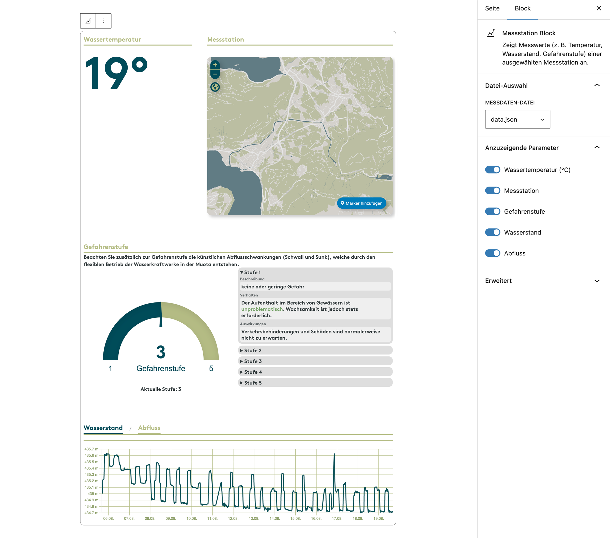
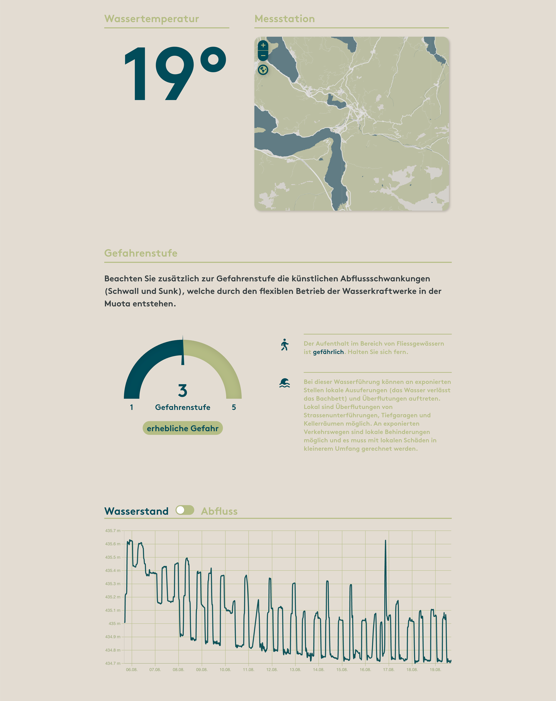

# UD Block: Messstation

Ein Block zur Anzeige aktueller Messwerte (z. B. Temperatur, Wasserstand, Abfluss oder Gefahrenstufe) einer definierten Messstation.
Er liest strukturierte JSON-Daten aus einer konfigurierbaren Quelle und stellt sie übersichtlich im Frontend dar – ergänzt durch grafische Visualisierungen und Gefahrenhinweise.

---

## Funktionen

- Anzeige von Messwerten (z. B. Temperatur, Wasserstand, Abfluss, Gefahrenstufe)
- Datenquelle über zentrale Plugin-Option auswählbar (`settings.php`)
- Dynamische Auswahl der JSON-Datei im Block (`dataUrl`)
- Anpassbare Bezeichnungen für alle Messwerte (Temperatur, Wasserstand, Abfluss, Gefahrenstufe)
- Automatische Visualisierung der Gefahrenstufen
- Optional einblendbare Stationsbezeichnung (`showStation`)
- Integration von Chart.js und JustGage für Echtzeit-Darstellung
- Automatische DOM-Aktualisierung bei neuen Messdaten
- Vollständig kompatibel mit Full Site Editing (FSE)

---

## Editor-Ansicht

*Abbildung: Der Block im Editor mit Auswahlfeld für die JSON-Datei und sichtbaren Messwerten.*

---

## Frontend-Ansicht

*Abbildung: Darstellung der Messstation mit aktuellen Werten und Gefahrenstufen.*

---

## Technische Details

- Entwickelt mit [`@wordpress/scripts`](https://developer.wordpress.org/block-editor/reference-guides/packages/packages-scripts/)
- Block-Registrierung über `block-register.php`
- REST-Integration (`rest-api.php`) zur Abfrage und Verarbeitung der Messdaten
- Plugin-Optionen über `settings.php` zur Definition des JSON-Verzeichnisses
- `render.php` für serverseitige Ausgabe und Fallback-Logik
- Editor- und Frontend-Skripte klar getrennt (`src/js/edit.js`, `src/js/frontend.js`)
- Zentrale Attribute u. a.:
  - `dataUrl` – Pfad zur Messdaten-Datei (z. B. `/wp-content/uploads/messdaten/data.json`)
  - `visibleKeys` – sichtbare Werte (z. B. `waterTemperature`, `waterLevel`, `discharge`)
  - `dangerLevels` – definierte Gefahrenstufen und Beschreibungen

---

## Installation

1. Plugin-Ordner `ud-messstation-block` in `wp-content/plugins/` kopieren
2. Im WordPress-Backend unter **Plugins → Installierte Plugins** aktivieren
3. In den Block-Einstellungen das JSON-Verzeichnis definieren
4. Im Editor den Block **„UD Messstation“** einfügen und gewünschte Datei auswählen

---

## Anforderungen

- WordPress ≥ 6.7
- PHP ≥ 7.4
- Aktiver Block-Editor (Gutenberg oder FSE-kompatibles Theme)

---

## Autor

**ulrich.digital gmbh**
[https://ulrich.digital](https://ulrich.digital)

---

## Lizenz

GPL v2 or later
[https://www.gnu.org/licenses/gpl-2.0.html](https://www.gnu.org/licenses/gpl-2.0.html)
